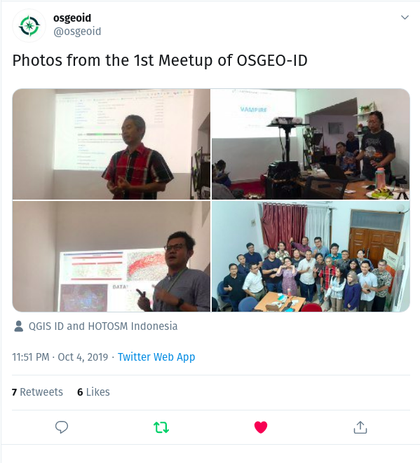

---?color=solid(white)
@title[Geospatial Analyses with R and QGIS]

@snap[center text-blue text-15]
### Geospatial Analyses with R and QGIS
@snapend

@snap[south]
Firman Hadi
firman@indotechsa.com
@snapend

@snap[north-east span-25]

@snapend

@snap[north-west span-8]

@snapend

---?color=black
@snap[north span-70]
## www.osgeo.id
@snapend

@snap[south-west span-50]

@snapend

@snap[south-east span-47]

@snapend

---?color=black
@snap[north span-90]
## Geospatial analyses
@snapend

@snap[west span-40]

@snapend

@snap[east span-55]
@ul[list-spaced-bullets text-white text-09]
- More than 80% of data related to location
- The human brain doesn't work in rows and columns
- Harness the power of place
@ulend
@snapend

---?color=black
@snap[north span-120]
## Benefits
@snapend

@snap[east span-40]

@snapend

@snap[west span-55]
@ul[list-spaced-bullets text-white text-09]
- Engage analytics with more insight
- Move from hindsight to foresight
- Develop target solutions
@ulend
@snapend

---
@snap[north span-50]
## Raster
@snapend

@snap[south span-60]

@snapend

---
@snap[north span-50]
## Vector
@snapend

@snap[south span-55]

@snapend

---?color=black
@snap[north span-50]
## Softwares
@snapend

@snap[midpoint span-25]

@snapend

@snap[west span-25]

@snapend

@snap[east span-25]

@snapend

---?color=black

@snap[north span-30]
## QGIS vs R
@snapend

@snap[center span-120]
@table[table-header custom-header custom-spacing text-06](assets/csv/r_vs_qgis.csv)
@snapend
---

## Install Packages

@code[R zoom-7](assets/src/install.R)

@snap[south span-100 text-08]
@[1-6,zoom-16](<h2>Packages</h2>)
@[6-8,zoom-16](<h2>Packages</h2>)
@snapend

---?image=assets/img/presenter.jpg

@snap[north span-100 h2-white]
## Any question?
@snapend

@snap[south span-100 text-06]
[You can download this presentation at](https://gitpitch.com/firmanhadi/pitch_fmipa-untan)
@snapend
